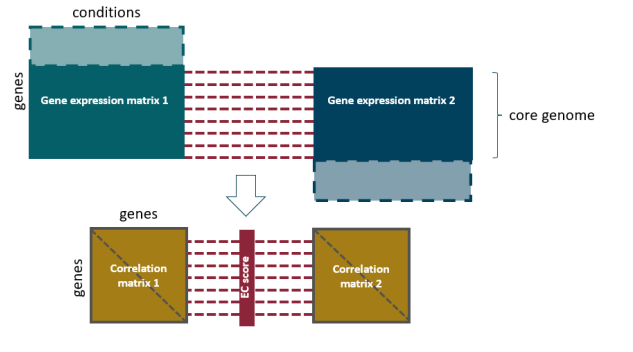

# gccR
gene co-expression conservation calculations in R


# Functionality
- Expression conservation (EC) calculations between two gene expression compendia
- Identification and analysis of functional expression classes (FECs)

# ICC Method Overview

## Input
The ICC (Iterative Comparison of gene Co-expression) method starts with two gene expression matrices, M1 and M2. These matrices typically represent expression data for two distinct species. Both M1 and M2 should include measurements for multiple genes (rows) across various conditions (columns). In our experiments, log fold changes were used, where each expression value signifies a change relative to a "control" condition.

## Expression Conservation (EC) Calculation
We employ the *Iterative Comparison of gene Co-expression (ICC)* procedure for EC calculation, and implemented these steps:

1. **Symmetrical Correlation Matrices**: Obtain symmetrical correlation matrices for each strain.
2. **Orthologous Gene Pair Alignment**: Extract submatrices comprising genes with orthologous counterparts in the other strain and reorder them. This ensures that a given row 'n' in both M1 and M2 corresponds to an orthologous gene pair.
3. **Weighted Pearson Correlation**: We next perform an iterative calculation of weighted Pearson correlation for each orthologous gene pair to derive the final EC score. The weight vector is determined by the previous set of correlation values, with negative values set to '0' to minimize the impact of highly divergent gene pairs.
4. **Calculation Details**: Utilize the `wtd.cors` function from the weights package v1.0.4 for the weighted correlation calculations. Repeat the calculations until convergence is achieved, defined as a difference of less than 0.0001 (default value, adaptable) between a given EC value and the EC value of the previous iteration.

<p align="center">
  
</p>

## EC Background Distributions
Distinguishing actual biological divergence in co-expression conservation from technical noise involves estimating two distributions.

1. **Conserved Distribution**: _Calculate how low EC values could be due to technical variation in the scenario of perfect conservation_. This distribution considers variation introduced by different conditions and is calculated by splitting the largest gene expression compendium and performing the ICC procedure. Optionally, the procedure can be repeated ten times on different data splits, considering experiment grouping. *Genes with EC values lower than the minimum of this distribution have likely not conserved their co-expression profile across strains/species*
2. **Diverged Distribution**: _Calculate the maximum EC value attainable when there is no correlation between two gene co-expression profiles_. This involves permutating the expression values of only one gene per iteration, resulting in a conservative random distribution. *Genes with EC values higher than the maximum of this distribution likely have conserved their gene co-expression profile across strains*.

# Installation

``` r
# Installation is currently only possible via the development version from GitHub:
devtools::install_github("Cuypers-Wim/gccR")
```

# Example usage

```R
library(gccR)

# path to two gene expression datasets (e.g downloaded from COLOMBOS.net) that you wish to compare

dataset1 <- file.path("/path/to/expressionCompendium1.txt")
dataset2 <- file.path("/path/to/expressionCompendium2.txt")

# path to a list of orthologs (column1 = gene IDs dataset1, and column2 = orthologuous dataset2 IDs)

orthologs <- file.path("/this/path/points/to/ortologs.txt")

# load gene expression data

exprList <- readData(dataset1, dataset2, NAstring = "NaN", source = "COLOMBOS")

# compute correlation matrices

corM1 <- get_corM(exprList$exprValues1, dropNArows = TRUE)
corM2 <- get_corM(exprList$exprValues2, dropNArows = TRUE)

# extract submatrices

corM_ortho <- extract_core_submatrix(corM1, corM2, singleCopyOrthologs)

# order matrix 2 according to matrix 1 (given a list of orthologs if IDs differ)

csM2_ordered <- sort_matrix(corM_ortho$csM1, corM_ortho$csM2, singleCopyOrthologs)

# compute the expression conservation scores by means of iterative comparison of co-expression

EC <- getEC(corM_ortho$csM1, csM2_ordered, 0.001)

# estimate background distributions

perfectEC1  <- perfect_EC(exprList$exprValues2, csM2_ordered, conv = 0.001, maxIter = 200)
randomEC1 <- divergedEC(exprList$exprValues2, csM2_ordered, singleCopyOrthologs, EC$ECweights)

# These datasets can now be visualised and furter interrogated

```

# Credits
  Adapted from:
 - Sonego P. et al. (2015) 
 - Meysman P. et al. (2013)
